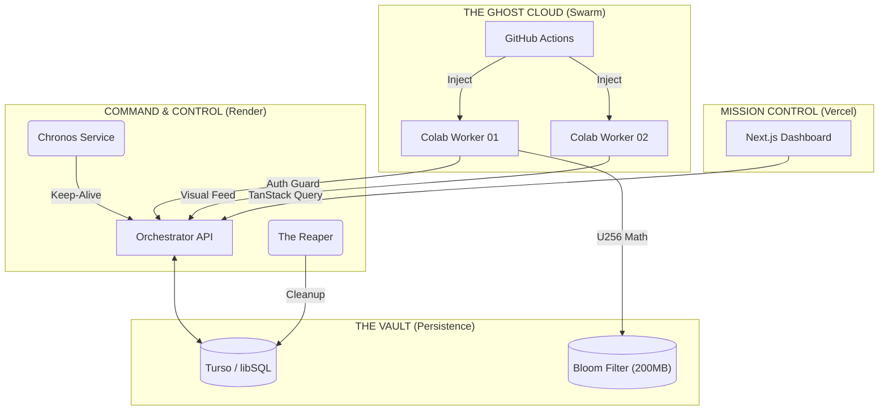

# ⚡ PROSPECTOR BTC // HYDRA-ZERO

### Distributed Cryptographic Audit System targeting secp256k1 Entropy Clusters

> **🎓 PROYECTO DE INVESTIGACIÓN DOCTORAL**
>
> **Institución Alvo:** Massachusetts Institute of Technology (MIT)
> **Foco:** Arqueología de Entropía, Ciberseguridad Ofensiva y Computación Oportunista.
> **Estado:** `DEPLOYED / OPERATIONAL`

---

## 🌌 1. Resumen Ejecutivo: El Arqueólogo de Entropía

La seguridad de Bitcoin se basa en la premisa termodinámica de que recorrer un espacio de $2^{256}$ es imposible. **Prospector BTC** desafía esta premisa no mediante fuerza bruta, sino mediante **Arqueología Digital**.

El sistema asume que la entropía humana es defectuosa. Históricamente, "Brainwallets" y generadores de números aleatorios rotos (Debian 2008, Android 2013) han creado **aglomerados densos de vulnerabilidad**. Prospector utiliza una arquitectura distribuida de **Costo Cero** para mapear y auditar estos sectores utilizando recursos efímeros de la nube (Google Colab, Github Actions).

### 🏆 Hitos de Ingeniería (V3.5)

- **Soberanía Matemática:** Núcleo migrado a aritmética de precisión arbitraria (`BigUint`), soportando el espacio completo de 256 bits sin desbordamiento.
- **Enjambre Autocurativo:** Protocolo _Identity Kill Switch_. Si un nodo detecta fallo de sesión, se notifica al orquestador y la identidad se revoca automáticamente.
- **Tríada de Despliegue:** Orquestación sincronizada entre **Render** (Backend), **Vercel** (Frontend) y **GitHub Actions** (Provisioner).

---

## 🏛️ 2. Arquitectura del Sistema (Hydra-Zero)

El sistema opera como un **Monolito Modular Estricto** gestionado por Nx.

🛠️ Stack Tecnológico de Elite
Componente Tecnología Justificación de Ingeniería
Core Engine Rust (no_std) Instrucciones AVX-512 y gestión de memoria manual para máxima velocidad de hash (22562256 ready).
Orquestación Nx Monorepo Gestión de dependencias estricta, caché computacional y límites arquitectónicos (Boundaries).
Probabilística Bloom Filters Verificación

O(1)O(1)

de 50M de direcciones en milisegundos sin I/O de disco.
Persistencia Turso (libSQL) Base de datos distribuida en el borde (Edge) con replicación global gratuita.
Evasión Playwright + Stealth Inyección de huellas digitales sintéticas y purificación de cookies para evitar detección de bots.
📂 3. Estructura Fractal (El Codex)

La base de código sigue el principio de Responsabilidad Única.

<strong>🔍 Ver Árbol de Directorios</strong>

code Text

prospector/
├── apps/ # 🚀 APLICACIONES (Ejecutables)
│ ├── orchestrator/ # API Server (Axum/Rust). El Cerebro.
│ ├── miner-worker/ # Binario Estático (Rust/Musl). El Músculo.
│ ├── web-dashboard/ # UI Científica (Next.js). La Cara.
│ └── census-taker/ # ETL Pipeline (Rust). El Cartógrafo.
│
├── libs/ # 🧩 LIBRERÍAS (Bloques LEGO)
│ ├── core/ # [CAPA 1] MATEMÁTICA PURA
│ │ ├── math-engine/ # Curvas Elípticas (secp256k1) & BigInt.
│ │ └── probabilistic/ # Estructuras de Bloom.
│ │
│ ├── domain/ # [CAPA 2] LÓGICA DE NEGOCIO
│ │ ├── mining-strategy/ # Motores de búsqueda (Combinatoria, Diccionario).
│ │ ├── forensics/ # Arqueología (Debian RNG Bug).
│ │ └── models-rs/ # DTOs y Entidades (Single Source of Truth).
│ │
│ └── infra/ # [CAMADA 3] MUNDO REAL
│ ├── db-turso/ # Repositorios Atómicos ACID.
│ └── transport/ # Serialización Binaria.
│
├── tools/ # 🛠️ HERRAMIENTAS OPS
│ └── provisioner/ # Script de Inyección (TypeScript/Playwright).

🚀 4. Guía de Despliegue (Operaciones)
A. Compilación del Minero (Cross-Compilation)

Para generar el artefacto compatible con Google Colab (Linux) desde Windows:
code Powershell

# Ejecutar el script de construcción estática (Requiere Docker)

./scripts/build_miner_static.ps1

Output: dist/target/x86_64-unknown-linux-musl/release/miner-worker
B. Configuración de Entorno

Crea un archivo .env en la raíz (ignorado por git):
code Ini

# Base de Datos

DATABASE_URL="file:prospector.db" # O libsql://... para prod
TURSO_AUTH_TOKEN="tu_token_aqui"

# Seguridad

WORKER_AUTH_TOKEN="secreto_maestro_del_enjambre"

# Configuración

RUST_LOG="info,prospector_orchestrator=debug"
PORT=3000

C. Despliegue de la Tríada

    Orchestrator: Push a rama main -> Render construye el Dockerfile automáticamente.

    Dashboard: Push a rama main -> Vercel detecta la app Next.js.

    Swarm: Configurar Secrets en GitHub y activar el Workflow Provisioner Cron.

🧪 5. Metodología "Ghost Cloud"

Para probar la tesis sin costos de infraestructura (AWS/GCP), utilizamos computación oportunista:

    Extracción: Census Taker comprime el UTXO set de Bitcoin (600GB) en un filtro de 200MB.

    Distribución: GitHub Actions despierta instancias de Google Colab gratuitas (GPUs T4).

    Inyección: El Provisioner inyecta el binario miner-worker en la memoria de la VM.

    Ejecución: El binario mina a velocidades nativas (Rust SIMD) reportando solo hallazgos positivos.

    Autocuración: Si una sesión caduca, el worker se autodestruye y notifica al sistema para rotar credenciales.

📜 Licencia y Ética

Copyright © 2025 Raz Podesta | MetaShark Tech.

Este proyecto es estritamente académico y destinado a la investigación de seguridad y entropía. El uso de este software para acceder a activos digitales sin autorización es ilegal y contrario a los objetivos de esta tesis.

Distribuido bajo la Licencia Académica MIT.
